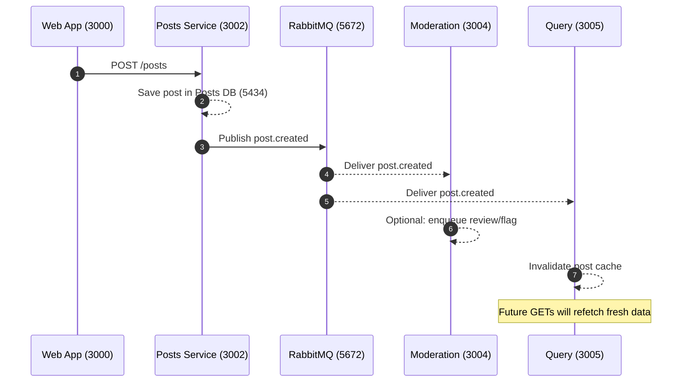
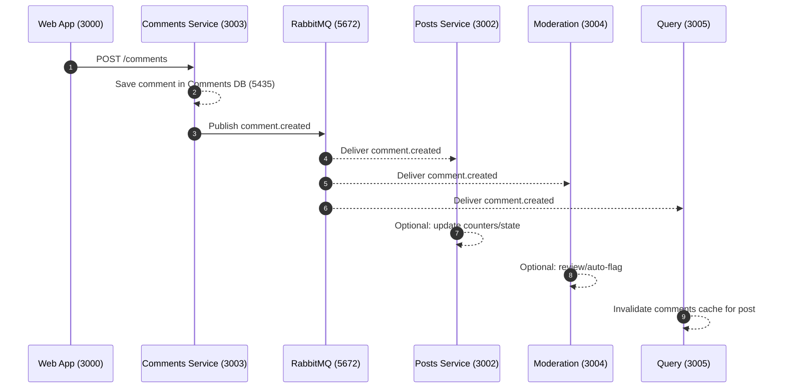
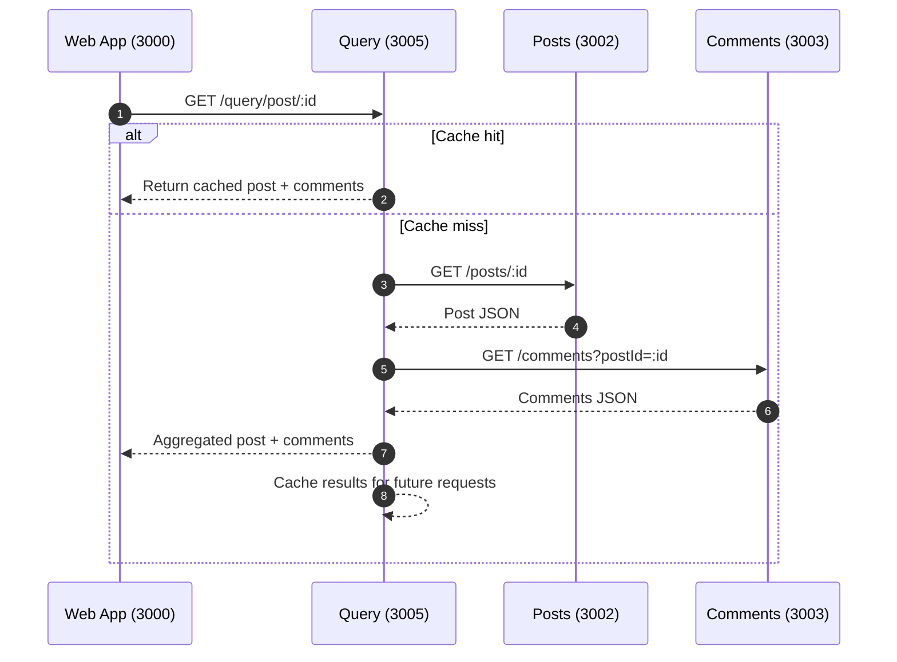

# Blog App - Event-Driven Microservices Architecture

A blog application built with **event-driven microservices architecture** using Node.js, PostgreSQL, Prisma, RabbitMQ, and Next.js.

## 🚀 Key Features

- **Event-Driven Communication**: All services communicate through RabbitMQ events
- **Intelligent Caching**: Query service with event-driven cache invalidation
- **Real-time Updates**: Services react to changes immediately through events
- **Scalable Architecture**: Services can scale independently
- **Reliable Messaging**: RabbitMQ provides durability and retry mechanisms

## 🏗️ Architecture Overview

### Event-Driven Communication Flow

```
┌─────────────┐    ┌─────────────┐    ┌─────────────┐
│   Auth      │    │   Posts     │    │  Comments   │
│  Service    │    │  Service    │    │  Service    │
└─────────────┘    └─────────────┘    └─────────────┘
       │                   │                   │
       └───────────────────┼───────────────────┘
                           │
                   ┌─────────────┐
                   │  RabbitMQ   │
                   │   Events    │
                   └─────────────┘
                           │
       ┌───────────────────┼───────────────────┐
       │                   │                   │
┌─────────────┐    ┌─────────────┐    ┌─────────────┐
│ Moderation  │    │   Query     │    │    Web      │
│  Service    │    │  Service    │    │    App      │
└─────────────┘    └─────────────┘    └─────────────┘
```

### Microservices

1. **Auth Service** (Port 3001)
   - User authentication and session management
   - Publishes: `user.registered`, `user.logged_in`, `user.logged_out`
   - Database: PostgreSQL (Port 5433)

2. **Posts Service** (Port 3002)
   - Blog post management
   - Publishes: `post.created`, `post.updated`, `post.deleted`, `post.published`
   - Database: PostgreSQL (Port 5434)

3. **Comments Service** (Port 3003)
   - Comment management for posts
   - Publishes: `comment.created`, `comment.updated`, `comment.deleted`
   - Database: PostgreSQL (Port 5435)

4. **Moderation Service** (Port 3004)
   - Content moderation
   - Publishes: `content.flagged`, `content.approved`, `content.rejected`
   - Database: PostgreSQL (Port 5436)

5. **Query Service** (Port 3005)
   - Data aggregation with intelligent caching
   - Publishes: `cache.invalidated`
   - Uses event-driven cache invalidation

6. **Web App** (Port 3000)
   - Next.js frontend application
   - Consumes aggregated data from Query Service

### Ports Map

| Component                | Port  |
| ------------------------ | ----- |
| Web App (Next.js)        | 3000  |
| Auth Service             | 3001  |
| Posts Service            | 3002  |
| Comments Service         | 3003  |
| Moderation Service       | 3004  |
| Query Service            | 3005  |
| RabbitMQ (AMQP)          | 5672  |
| RabbitMQ Management      | 15672 |
| Auth DB (Postgres)       | 5433  |
| Posts DB (Postgres)      | 5434  |
| Comments DB (Postgres)   | 5435  |
| Moderation DB (Postgres) | 5436  |

### Infrastructure

- **RabbitMQ** (Port 5672)
  - Message broker for event-driven communication
  - Management UI: http://localhost:15672 (admin/admin)
  - Dead letter queues for failed message handling
  - Retry mechanisms for reliability

- **PostgreSQL Databases**
  - Each service has its own independent database
  - Ports: 5433 (Auth), 5434 (Posts), 5435 (Comments), 5436 (Moderation)

## 📡 Event Types

### Auth Events

- `user.registered` → Notifies all services of new user
- `user.logged_in` → Notifies services of user activity
- `user.logged_out` → Notifies services of user logout

### Posts Events

- `post.created` → Notifies comments, moderation, query services
- `post.updated` → Triggers cache invalidation
- `post.deleted` → Notifies dependent services
- `post.published` → Notifies services of public content

### Comments Events

- `comment.created` → Notifies posts, moderation, query services
- `comment.updated` → Triggers cache invalidation
- `comment.deleted` → Notifies dependent services

### Moderation Events

- `content.flagged` → Notifies all services of flagged content
- `content.approved` → Notifies services of approved content
- `content.rejected` → Notifies services of rejected content

### Cache Events

- `cache.invalidated` → Notifies query service of cache changes

## 🧭 How workflows behave







## 🚀 Getting Started

### Prerequisites

- Node.js 18+
- Docker and Docker Compose
- pnpm

### Quick Start

```bash
# Clone the repository
cd blog-k8s

# Install dependencies
pnpm install

# Start Docker services (PostgreSQL databases and RabbitMQ)
docker-compose up -d

# Generate Prisma clients
make generate

# Run database migrations
make migrate

# Start all services in development mode
make dev
```

### Access Points

- **Frontend**: http://localhost:3000
- **Auth Service**: http://localhost:3001
- **Posts Service**: http://localhost:3002
- **Comments Service**: http://localhost:3003
- **Moderation Service**: http://localhost:3004
- **Query Service**: http://localhost:3005
- **RabbitMQ Management**: http://localhost:15672 (admin/admin)

### Query API quick reference

- GET `http://localhost:3005/query/post/:id` → Aggregated post with comments (cached)
- GET `http://localhost:3005/query/posts` → All published posts with comments (fresh fetch)
- POST `http://localhost:3005/query/cache/invalidate { cacheKey?: string }` → Manual invalidation
- GET `http://localhost:3005/query/cache/stats` → Cache keys and sizes

## 🔧 Development

### Event-Driven Development

1. **Adding New Events**:
   - Define event types in `shared/rabbitmq/src/events/event.types.ts`
   - Update event routing configuration
   - Implement event handlers in relevant services

2. **Service Communication**:
   - Use RabbitMQ events for cross-service communication
   - Keep HTTP calls minimal (only for direct data fetching)
   - Implement event handlers for reactive updates

3. **Cache Management**:
   - Query service automatically invalidates cache based on events
   - Use cache stats endpoint to monitor cache performance
   - Implement granular cache invalidation for optimal performance

### Testing Events

```bash
# Monitor RabbitMQ events
# Visit http://localhost:15672 and check the "Exchanges" tab

# Check cache stats
curl http://localhost:3005/query/cache/stats

# Manually invalidate cache
curl -X POST http://localhost:3005/query/cache/invalidate \
  -H "Content-Type: application/json" \
  -d '{"cacheKey": "post:123"}'
```

## 📊 Monitoring

### RabbitMQ Management

- **URL**: http://localhost:15672
- **Username**: admin
- **Password**: admin
- Monitor exchanges, queues, and message flow
- Check dead letter queues for failed messages

### Service Logs

Each service logs event processing:

```bash
# View service logs
docker-compose logs -f auth
docker-compose logs -f posts
docker-compose logs -f comments
docker-compose logs -f moderation
docker-compose logs -f query
```

## 🛠️ Technology Stack

- **Backend**: NestJS, TypeScript, Prisma ORM
- **Frontend**: Next.js 14, React, TypeScript, Tailwind CSS
- **Databases**: PostgreSQL (one per microservice)
- **Message Broker**: RabbitMQ with dead letter queues
- **Containerization**: Docker, Docker Compose
- **Package Manager**: pnpm
- **Build System**: Turbo (monorepo)

## 🔄 Event Flow Examples

### User Registration Flow

1. User registers → Auth Service
2. Auth Service publishes `user.registered` event
3. Posts, Comments, Moderation services receive event
4. Services can initialize user-specific data

### Post Creation Flow

1. User creates post → Posts Service
2. Posts Service publishes `post.created` event
3. Comments Service prepares for potential comments
4. Moderation Service flags for review
5. Query Service invalidates cache

### Comment Addition Flow

1. User adds comment → Comments Service
2. Comments Service publishes `comment.created` event
3. Posts Service updates comment count
4. Moderation Service reviews comment
5. Query Service invalidates comments cache

## 🎯 Benefits

1. **Decoupling**: Services are loosely coupled through events
2. **Scalability**: Services can scale independently
3. **Reliability**: Events provide durability and retry mechanisms
4. **Real-time Updates**: Services react to changes immediately
5. **Cache Invalidation**: Intelligent cache management through events
6. **Audit Trail**: All events are logged for debugging and monitoring
7. **Fault Tolerance**: Dead letter queues handle failed messages
8. **Performance**: Intelligent caching reduces database load

## 📝 Next Steps

1. **Start the application**: `make dev`
2. **Create your first user**: Visit http://localhost:3000/auth
3. **Monitor events**: Check RabbitMQ management UI
4. **Test cache invalidation**: Create posts and comments
5. **Explore the architecture**: Read ARCHITECTURE.md for detailed design

## 📚 Documentation

- **README.md**: This overview
- **ARCHITECTURE.md**: Detailed system architecture
- **QUICK_START.md**: Quick start guide
- **PROJECT_SUMMARY.md**: Project summary

---

**Status**: ✅ Event-driven architecture implemented and ready to run! 🚀
